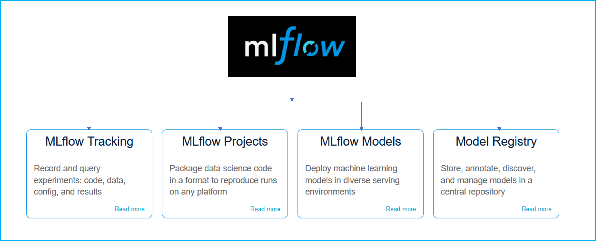

# mlflow_tutorial
MLFlow tutorial - model montioring, model registry, model serving, model deployment

## What is MLFlow and its Components

MLFLow is an open source platform to manage the ML lifecycle, including experimentation, reproducibility, deployment, and a central model registry. MLFLow currently offers four components:

<a>https://www.mlflow.org/</a>

if want to use the model registry feature, we need a database.
If you have MySQL installed then you can use the below command:
Create a database to use as an MLflow backend tracking server.
CREATE DATABASE mlflow_tracking_database;

Start MLflow tracking server using MySQL as a backend tracking store.
mlflow server \ --backend-store-uri mysql+pymysql://root@localhost/mlflow_tracking_database \ --default-artifact-root file:/./mlruns \ -h 0.0.0.0 -p 5000

Set the MLflow tracking uri (within code section).
mlflow.set_tracking_uri("http://localhost:5000")

If you have sqlite installed then you can use the below command:
Start MLflow tracking server using sqlite as a backend tracking store.
mlflow server --backend-store-uri sqlite:///mlflow.db --default-artifact-root ./artifacts --host 0.0.0.0 --port 5000

Set the MLflow tracking uri (within code section).

mlflow.set_tracking_uri("http://localhost:5000")

You can also follow the official documentation for more information on backend database for model registry

https://www.mlflow.org/docs/latest/model-registry.html#model-registry-workflows
